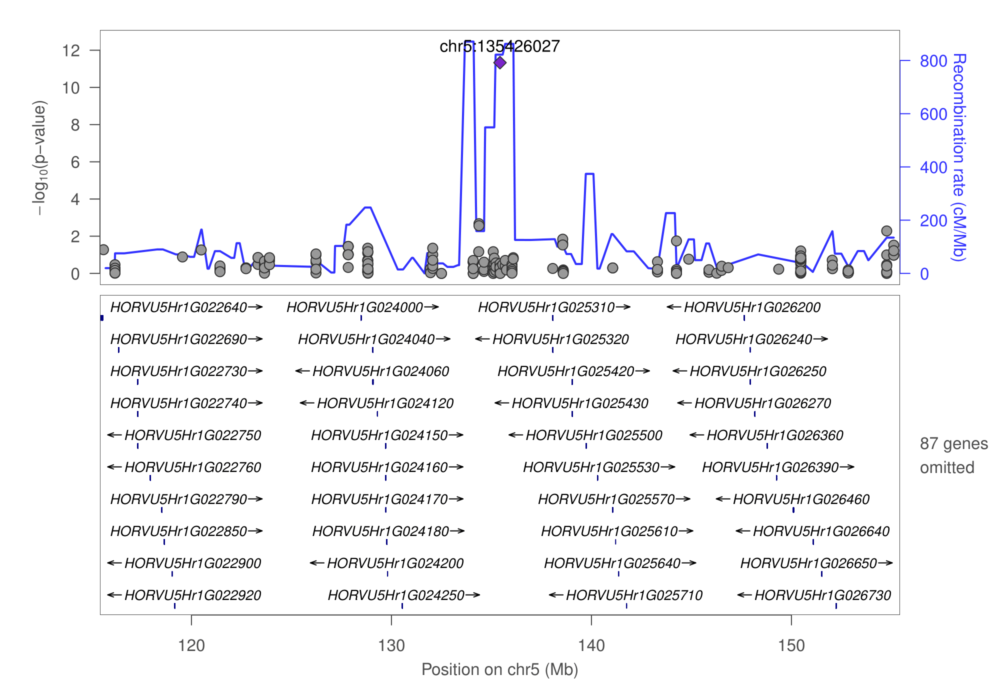

# LocusZoom Pipeline Project for any  with reference species

#### LocusZoom plot for barley eQTL result with gene: HORVU0Hr1G019610 


#### LocusZoom plot for barley eQTL result with gene: HORVU7Hr1G119370



## Preparing the database for reference 

#### Inserting refFlat
> The [refFlat](https://genome-source.gi.ucsc.edu/gitlist/kent.git/raw/master/src/hg/lib/refFlat.as) table mirrors what is currently supplied by the refFlat table in the UCSC database. 
- you need too qsub my Pipeline,cs will take a while for get the reffalt table, if your species reference genome was big,then will taken more time to get the refFlat table. my demo was the [barley](ftp://ftp.ensemblgenomes.org/pub/plants/release-44/gff3/hordeum_vulgare) genome and needs more five hours.
```linux
$ nohup qsub perl refflat.pipeline.pl -gff ref.gff -out ./ &
```
* The pipeline will get snn.pos and refflat.tbale, then
```python
$ python dbmeister.py --db barley.db --snp_pos snp.pos
$ python dbmeister.py --db barley.db --refflat refflat.table
```
### Estimate recombination rates from population genetic data  
 
* phased your genotypy first or not 

    ```java
    $ java -jar beagle.11Mar19.69c.jar gt=pop.recode.vcf.gz out=pop.phased.vcf.gz
    ```
* if your genotype already phased 
    ```perl
    $ perl get.FastEPRR.pl -vcf pop.recode.vcf -out pop.phased.vcf 
    ```
* change the name chr(chart) to numric 
    ```linux
    $ less pop.recode.vcf |perl -ne 'chomp;if(/#/){print "$_\n"}else{($chr,$all)=split/\s+/,$_,2;$chr=~s/chr//g;print "$chr\t$all\n"}' > pop.vcf
    ```
* after phased , split your pop.phased.vcf with single chromosome to VCF dir
    ```linux
    $ less list |perl -ne 'chomp;`vcftools --vcf pop.vcf --chr $_ --recode --out pop.$_.vcf.gz && gzip pop.$_.vcf.gz`'
    ```
* Estimate recombination rates using the FastEPRR packages
    ```r
    $ Rscipt rho.R --input ./
    ```
* after finished
    ```perl
    $ perl get.gasteprr.result.pl -int ./ -out fasteprr.result
    ```
* and
    ```perl
    $ perl get.rho.result.pl -result fasteprr.result -vcf pop.recode.vcf -out recomb_rate.table
    ```
* then
    ```python
    $ python dbmeister.py --db barley.db --recomb_rate recomb_rate.table
    ```
- if you got Error: file recomb_rate.table does not have tthe proper number of columns (or your delimiter is incorrect.) 
    ```linux
    $ less recomb_rate.table |sed 's/\s/\t/g' > recomb_rate.delimiter.table && python dbmeister.py --db barley.db --recomb_rate recomb_rate.delimiter.table
    ```

### optimization your own plot 

```python
$ ./../bin/locuszoom --metal chr5_135426027.metal --refsnp chr5:135426027 --flank 20MB  --build by38 --pop BARLEY --source 1000G_July2019 --no-cleanup
```

