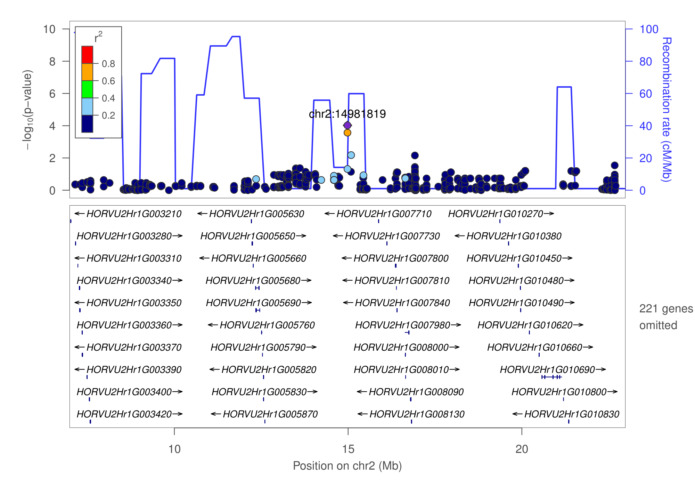
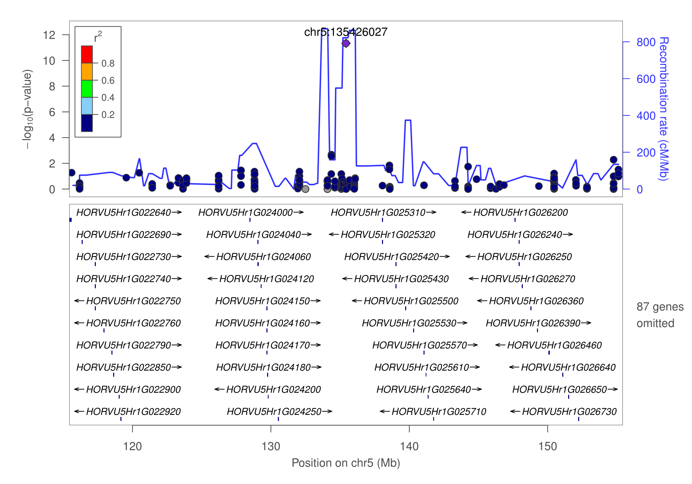
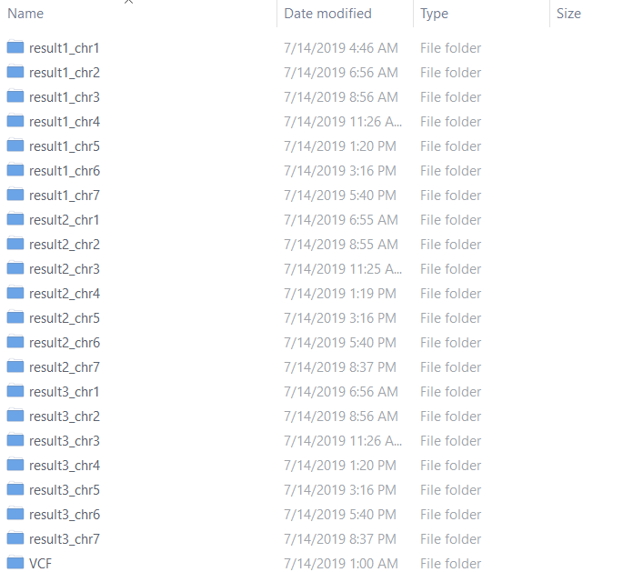
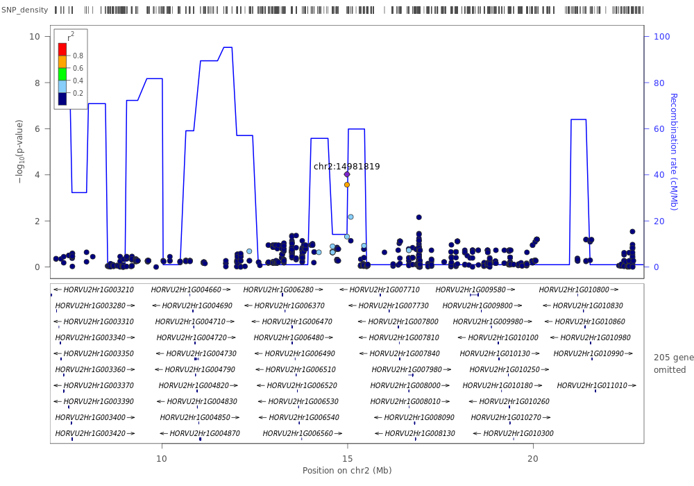
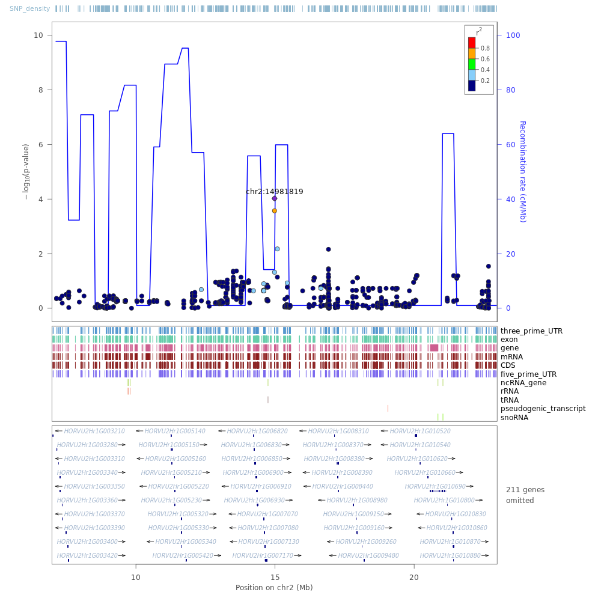

## LocusZoom Pipeline visualization of GWAS (eQTL, EWAS and TWAS)  regional results for research and publication 

  [LocusZoom](http://locuszoom.org/) is amazing tool for dataViz. It is so comfortable to visual human species GWAS or metal GWAS result etc, though. The author didn't provided a tool to how to prepare the refflat table like UCSC brower format. Cause the project needed, here, i wrote a pipeline to get the refFlat tabel and snp.pos and snp.set from any species and only need you to provide the annotation of genome (genome annotation file from the NCBI or ensembl or somewhere reasonable) and the SNP calling vcf file from your are interested in research result. And a pipleine for calculating the recombination rates also for any species. The details as following:

### Here were two eQTLs example result 

1. LocusZoom plot for barley eQTL(chr2:14981819) regional result with gene: HORVU0Hr1G019610 10Mb window size.



1. LocusZoom plot for barley eQTL(chr5:135426027) regional result with gene: HORVU7Hr1G119370 10Mb window size.



### Build own database  

#### How to get the refFlat and snp position table

> The [refFlat](https://genome-source.gi.ucsc.edu/gitlist/kent.git/raw/master/src/hg/lib/refFlat.as) table mirrors what is currently supplied by the UCSC database, [format](https://genome-source.gi.ucsc.edu/gitlist/kent.git/raw/master/src/hg/lib/refFlat.as). You need to qsub my Pipeline, cause it will take a while for get the reffalt table, if your species with a big reference genome, then will take more time to get the data result. my demo was the  [barley](ftp://ftp.ensemblgenomes.org/pub/plants/release-44/gff3/hordeum_vulgare) specie and needs more than five hours for now. And i will add a simple that get the refflab quickly than this pipeline times in the futher in Python Script.

```linux
# Pipeline Usage

$ perl refflat.pipeline.pl
Contact:        czheluo@gmail.com
Script:         refflat.pipeline.pl
Description:
        eg:perl refflat.pipeline.pl -chrlist ref.chrlist -gff ref.gff3 -vcf pop.recode.vcf -out ./
Usage:
  Options:
  -chrlist <file> the chromosome list file,and looks like: chr1 365483943
  -gff <file>  genome annotation file > *.gff3
  -vcf <file> *.vcf
  -out <dir> output director name
  -queue <str> default was "sh",for using to queue your job, or if you run in a server you just need to give the pathway.
  looks like; queue-seg.pl and also can add the resource of the memory
  -wsh <dir> the work shell default was "work_sh"
  -step <str> control the steps you want to run, upto 3
  -stop <str> as the same as step means

```

> QUEUE THE Pipeline 

```linux
$ nohup qsub perl refflat.pipeline.pl -chrlist ref.chrlist -gff ref.gff3 -vcf pop.recode.vcf -out ./ &
```
> or (which running local node in your machine)

```linux
$ nohup perl refflat.pipeline.pl -chrlist ref.chrlist -gff ref.gff3 -vcf pop.recode.vcf -out ./ &
```
>The pipeline will generate snp.pos, snp.set and refflat.tbale files for you to build YOUR database, excuting as following, and for details click [here](https://genome.sph.umich.edu/wiki/LocusZoom_Standalone).

```linux
$ python dbmeister.py --db barley.db --snp_pos snp.pos  
$ python dbmeister.py --db barley.db --refflat refflat.table  
$ python dbmeister.py --db locuszoom_by38.db --snp_set snp.set
```

### Estimating recombination rates from population genetic data  
> Currently, there are several popular softwares to calculate recombination rates which like [FastEPRR](http://www.picb.ac.cn/evolgen/softwares/FastEPRR.html), [LDhat](https://github.com/auton1/LDhat), and [MLrho](http://guanine.evolbio.mpg.de/mlRho/). Here, i will take the FastEPRR as example. For the detail introduction see [here](http://www.picb.ac.cn/evolgen/softwares/download/FastEPRR/FastEPRR2.0/FastEPRR_manual.pdf). Mainly include three steps, and before you need know your genotype was phased or not. if not, and you need to phase before running. Here, i using the [beagle](https://faculty.washington.edu/browning/beagle/beagle.html) for imputation and phased see following the details.

```linux
$ java -jar beagle.11Mar19.69c.jar gt=pop.recode.vcf.gz out=pop.phased.vcf.gz
```
> If your genotype already phased and impution, i wrote a perl script for get the data format for FastEPRR format from your vcf genotype file.
 
```linux
$ perl get.FastEPRR.pl -vcf pop.recode.vcf -out pop.phased.vcf 
```

> Make sure your chromesome in your vcf files AS numeric. If not, you can run a one liner perl for changing the string to numeric, as like:

```linux
$ less *.vcf |perl -ne 'chomp;if(/#/){print "$_\n"}else{($chr,$all)=split/\s+/,$_,2;$chr=~s/chr(any type in your file to replace)//g;print "$chr\t$all\n"}' > pop.vcf
```

> The FastEPRR can run single chromesome only, so you have to split your vcf genotype file to couples of vcf files. Here was my demo. Split it by vcftools super convenient in one liner command.
   
```linux
$ less list(a chromesome list for your specie) |perl -ne 'chomp;`vcftools --vcf pop.vcf --chr $_ --recode --out pop.$_.vcf.gz && gzip pop.$_.vcf.gz`'
```
> After get all chrs vcf files, you just can run my R pipeline code as following : 
```linux
# See the usage firt!

$ Rscipt rho.R 

Usage: rho.R [-[-input|i] <character>] [-[-output|o]] [-[-wl|l] <character>] [-[-wd|d] <character>] [-[-nj|n] <character>] [-[-cj|c] <character>] [-[-set|s] <character>] [-[-help|h]]
Usage example:
      Usage example:
      Rscript rho.R --input ./ --output result
      Usage:
      --input  dir for VCFs where is (give the absolute path)
      --output  output result dir
      --wl  the window Length (default: 500000)
      --wd the winDXThreshold (default: 10, not for human species (30))
      --nj the job number (default 1)
      --cj currently run job (default 1, and must less than job number value)
      --set Rho values of training set (default :0.0, 0.5, 1.0, 2.0, 5.0,  10.0,  20.0,  40.0,  70.0,  110.0,  170.0)
      --help            usage

$ nohup Rscript rho.R --input ./ --output result &
```

> After finished, you will get mutiple folders, and looks like : 

>Then you need run the perl script that following to get result, but not the last, you need add the cm_pos from your population genetic map. If not, you only need add additional column as the fourth (whatever you want), and then add it to your database.

```perl
$ perl get.gasteprr.result.pl -int ./ -out fasteprr.result
$ perl get.rho.result.pl -result fasteprr.result -vcf pop.recode.vcf -out recomb_rate.table
```

```linux
$ python dbmeister.py --db barley.db --recomb_rate recomb_rate.table 
```

> If you got Error: file recomb_rate.table does not have the proper number of columns (or your delimiter is incorrect.). Here was what problems i met that i already change the dbmeister.py delim for fit the format from my Perl pipeline result.
 
```linux
$ less recomb_rate.table |sed 's/\s/\t/g' > recomb_rate.delimiter.table && python dbmeister.py --db barley.db --recomb_rate recomb_rate.delimiter.table
```
### Optimization your own plot
> Which the althor already provided mutiple [LocusZoom options](https://genome.sph.umich.edu/wiki/LocusZoom_Standalone) for what you want to change the Figs. But those not for mine. So i have made slightly changed in locuszoom.R and the details as following.

> I have changed the output Figure for both PDF and PNG , and also the set color which will generate a random color (from the [RColorBrewer](https://cran.r-project.org/web/packages/RColorBrewer/index.html)  and will add the [ggsci](https://nanx.me/ggsci/articles/ggsci.html)) for snpset in locuszoom.R.
> 
```linux
$ ./../bin/locuszoom --metal chr5_135426027.metal --refsnp chr5:135426027 --flank 20MB  --build by38 --pop BARLEY --source 1000G_July2019 --no-cleanup  --delim space --snpset SNP_density
# --snpset args (the name in your db snp_set name)
```



### ADD bed track

> Here, you need install the [BEDOPS](https://bedops.readthedocs.io/en/latest/index.html) to convert any type your file format to the [bed format](http://genome.ucsc.edu/FAQ/FAQformat.html#format1.7). Or you only need to prepare your data frame with: chr, start, end, name (type: exon, CDS and gene ETC), score, strand, thickStart, thickEnd and itemRgb (YOUR name color, here, I make a change that according to your name which will make a random color (from the [RColorBrewer](https://cran.r-project.org/web/packages/RColorBrewer/index.html)  and will add the [ggsci](https://nanx.me/ggsci/articles/ggsci.html) for your name in locuszoom.R ) SO, you only need to prepare the above first four data frame is enough. Otherwhise, I also CHANGED the gene text color (LOL). If you want to keep the same as the orignal locuszoom color, you just change the default.args for locuszoom [options](https://genome.sph.umich.edu/wiki/LocusZoom_Standalone).

```linux
$ gff2bed < ref.gff > ref.bed && perl get.bed.pl -bed ref.bed -out ref.flab.bed
$ ./bin/locuszoom --metal test/HORVU7Hr1G119370.meta --refsnp chr2:14981819 --flank 8MB  --build by38 --pop BARLEY --source 1000G_July2019 --no-cleanup --snpset SNP_density --bed-tracks ../examples/ref.flab.bed legend='right'
```


