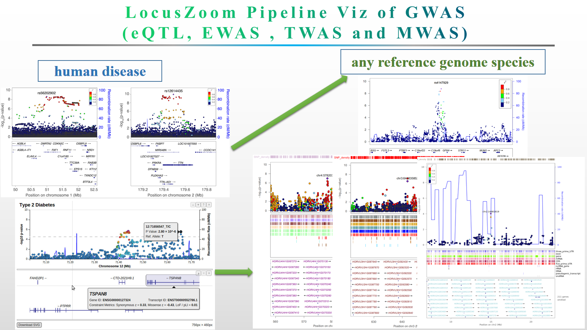

## LocusZoom Pipeline visualization of GWAS (eQTL, EWAS TWAS and MWAS)  regional results for research and publication <a href="Fig/locuszoom.png"></a>

  [LocusZoom](http://locuszoom.org/) is amazing tool for dataViz. It is so comfortable to visual human species GWAS or metal GWAS result etc, though. The author didn't provided a tool to how to prepare the refflat table like UCSC brower format. Cause the project needed, here, i wrote a pipeline to get the refFlat tabel and snp.pos and snp.set from any species and only need you to provide the annotation of genome (genome annotation file from the NCBI or ensembl or somewhere reasonable) and the SNP calling vcf file from your are interested in research result. And a pipleine for calculating the recombination rates also for any species. The details as following:

### Here were two eQTLs example result 

1. LocusZoom plot for barley eQTL(chr2:14981819) regional result with gene: HORVU0Hr1G019610 10Mb window size.


1. LocusZoom plot for barley eQTL(chr5:135426027) regional result with gene: HORVU7Hr1G119370 10Mb window size.


### Build own database  

#### How to get the refFlat and snp position table

> The [refFlat](https://genome-source.gi.ucsc.edu/gitlist/kent.git/raw/master/src/hg/lib/refFlat.as) table mirrors what is currently supplied by the UCSC database, [format](https://genome-source.gi.ucsc.edu/gitlist/kent.git/raw/master/src/hg/lib/refFlat.as). You need to qsub my Pipeline, cause it will take a while for get the reffalt table, if your species with a big reference genome, then will take more time to get the data result. my demo was the  [barley](ftp://ftp.ensemblgenomes.org/pub/plants/release-44/gff3/hordeum_vulgare) specie and needs more than five hours for now. And i will add a simple that get the refflab quickly than this pipeline times in the futher in Python Script.

```linux
# Pipeline Usage

$ perl refflat.pipeline.pl
Contact:        czheluo@gmail.com
Script:         refflat.pipeline.pl
Description:
        eg:perl refflat.pipeline.pl -chrlist ref.chrlist -gff ref.gff3 -vcf pop.recode.vcf -out ./
Usage:
  Options:
  -chrlist <file> the chromosome list file,and looks like: chr1 365483943
  -gff <file>  genome annotation file > *.gff3
  -vcf <file> *.vcf
  -out <dir> output director name
  -queue <str> default was "sh",for using to queue your job, or if you run in a server you just need to give the pathway.
  looks like; queue-seg.pl and also can add the resource of the memory
  -wsh <dir> the work shell default was "work_sh"
  -step <str> control the steps you want to run, upto 3
  -stop <str> as the same as step means

```
#### QUEUE THE Pipeline 

```linux
$ nohup qsub perl refflat.pipeline.pl -chrlist ref.chrlist -gff ref.gff3 -vcf pop.recode.vcf -out ./ &
```
> or (which running local node in your machine)

```linux
$ nohup perl refflat.pipeline.pl -chrlist ref.chrlist -gff ref.gff3 -vcf pop.recode.vcf -out ./ &
```
>The pipeline will generate snp.pos, snp.set and refflat.tbale files for you to build YOUR database, excuting as following, and for details click [here](https://genome.sph.umich.edu/wiki/LocusZoom_Standalone).

```linux
$ python dbmeister.py --db barley.db --snp_pos snp.pos  
```
